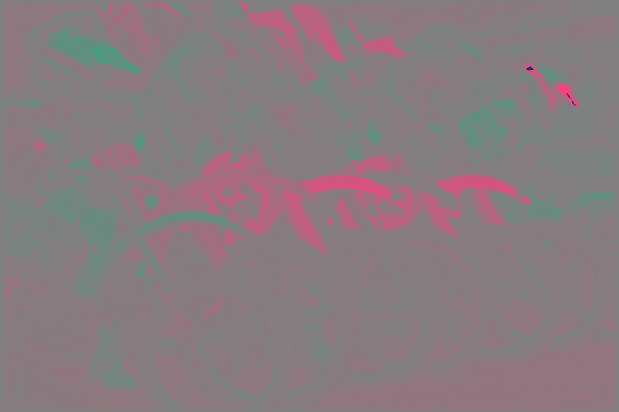
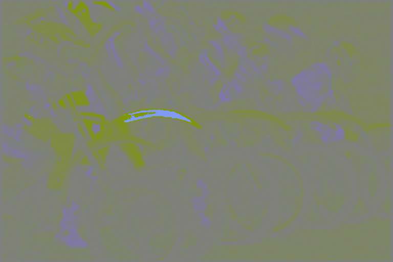
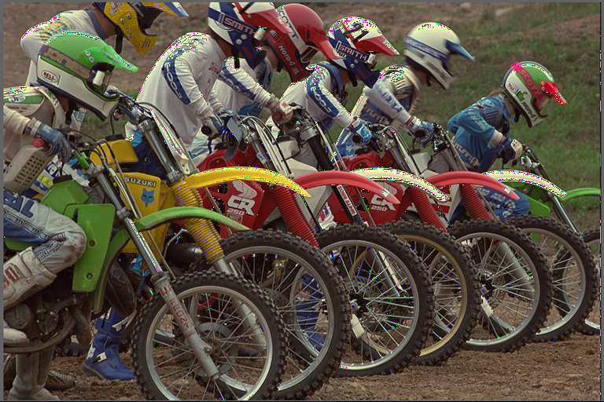

# JPEG Algorithm with Python

## By [Meny Buganim](todo), [Lital Hayat](todo) and [Baruch Rothkoff](todo)

### Build status

## Flow and explanation of JPEG algorithm

Note that because during the work we compare our results vs [cv2 library (OpenCV for Python)](TODO), who is display color in different order, our colors represented as **BGR** (instead of **RGB**) and **Y'CrCb** (instead of **Y'CbCr**)

### Original Image

### Convert to Y'CrCb

Y'CrCb is channels represention as luma component, blue-difference and red-difference ([from wikipedia](https://en.wikipedia.org/wiki/YCbCr)).

We know that __B__GR is  Blue, Green and Red channels, like this:

| B | G | R |
|:-: | :-: | :-: |
|  |  |  |

But Y'CrCb shouls be different division (Without lossing the data!):

| Y' | Cr | Cb |
|:-: | :-: | :-: |
|  |  |  |

We do this because the humen eyes are more luma sensitive to red and blue, so

### Downsampling

we can remove data from blue and red, and the impact of whole image will be less than downsapling BGR image, like that:

#### BGR Downsapling

#### Y'CrCb

