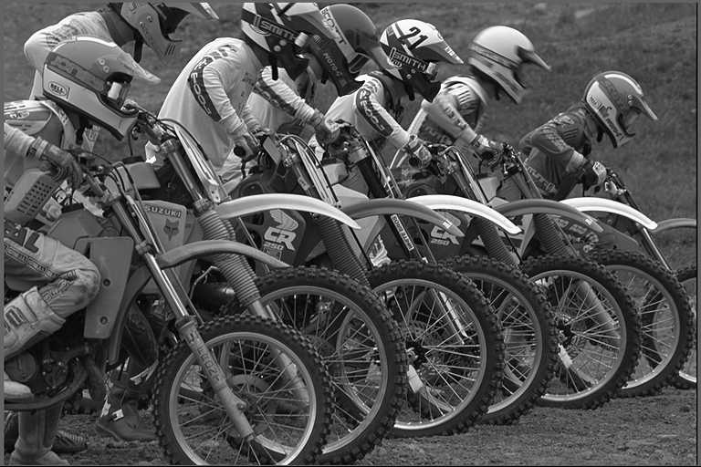
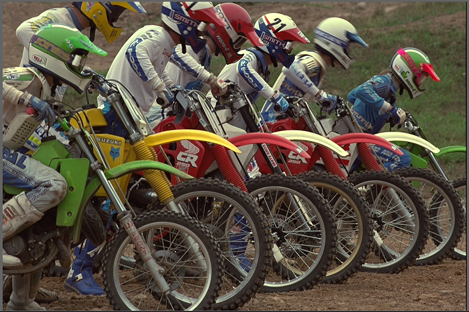
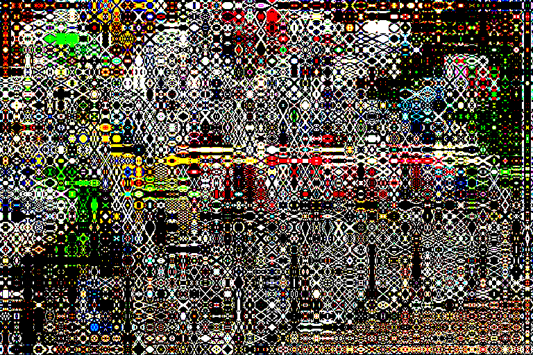
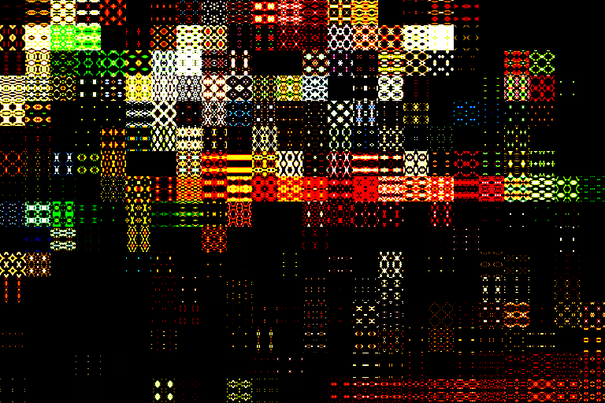

# JPEG Algorithm with Python

## By [Meny Buganim](https://github.com/MenyBgu), [Lital Hayat](mailto:Litali94@gmail.com) and [Baruch Rothkoff](https://github.com/baruchiro)

[](http://54.218.224.31:8080/job/python-JPEG/job/master/)

- ### [How to run](#Result)
- ### [Code Explanation](README.ipynb)

## Project goals

### The project objectives were:

1. To learn how _JPEG algorithm_ work
2. Accumulation of programming experience, especially in a _functional programming_ paradigm.

### The project objectives were _not_:

1. Implementing best performance Jpeg algorithm
2. Deep dive into _Jpeg file format_ and other files formats.

#### Additional points

- **TDD** (*T*est *D*riven *D*evelopment): We started to work on this project with TDD methodology, but we noticed that since these are mathematical operations on matrices, in order to write the tests we need to know what is the expected result, and to know the expected result we need to write the code.  
  But do not worry, we've still written tests, and still worked hard to pass them.
- **CI Pipline**: We have an Amazon machine that runs the Jenkins program, and for every push of a branch to server, or PR, she runs the tests to check that everything is done properly.  
  [You can see Jenkinsfile here](.github/Jenkinsfile).  
  In addition, we will be happy to [help](https://github.com/jenkins-baruch/python-JPEG/issues?utf8=%E2%9C%93&q=is%3Aissue+is%3Aopen+label%3ACI) add a stages to the pipline.

## Flow and explanation of JPEG algorithm

(Results from [generator.py](generator.py) file.)

Note that during the work we compare our results vs [cv2 library (OpenCV for Python)](https://github.com/skvark/opencv-python), which display color in different order. our colors represented as **BGR** (instead of **RGB**) and **Y'CrCb** (instead of **Y'CbCr**)

### Original Image


### Convert to Y'CrCb

Y'CrCb is channels representation as luma component, blue-difference and red-difference ([from wikipedia](https://en.wikipedia.org/wiki/YCbCr)).

We know that _BGR_ is *B*lue, *G*reen and *R*ed channels, like this:

|            R            |            G            |            B            |
| :---------------------: | :---------------------: | :---------------------: |
|  |  |  |

But Y'CrCb should be different division (Without losing the data!):

|            Y'            |            Cr             |            Cb             |
| :----------------------: | :-----------------------: | :-----------------------: |
|  |  |  |

We do this because the human eyes are more luma sensitive to red and blue, so

### Downsampling

we can remove data from blue and red, and the impact of whole image will be less than downsampling BGR image, like that:

#### BGR Downsampling


#### Y'CrCb Downsampling



### DCT

The next step is the significant stage in Jpeg algorithm. Based on Linear Algebra, the **D**iscrete **C**osine **T**ransform represent vectors as linear combination of cosine waves with different frequency, and then, because the human eye sensitive only to limited frequency range, we can remove some frequencies and the image still look similar.

In general, we split the image matrix to 8\*8 sub-matrices, thus we can treat them as a vectors in **R**64. Then, we have a 64 linear independent cosine vectors which spread the space, so each sub-matrix can be represent as 64 scalars that product the independent vectors.

### Quantization

After we have a 64 scalars for each `8*8=64` sub-matrix, we divide them by 64 const values, who is investigated and found to be most suitable for this case, and the biggest numbers are coordinate with high-frequency vectors. After dividing the scalars, most of high-frequencies scalars get a value between 0-1, and after floor-rounding they are will be 0. This result leading to a situation when we restore the image and do the opposite product operand, all the values that get a 0 in previous step, continuing to be 0 and not restoring to original value.

This is comparison between 8x8 DCT and 32x32 DCT:

|               8x8                |                16x16                |                32x32                |
| :------------------------------: | :---------------------------------: | :---------------------------------: |
|  |  |  |

## Result (How to run)

This result image should be identical to 8x8 DCT image above, but we get it by run the `run.py` file with the command:

```cmd
python run.py .\src\original.png .\src\result
```

The script `run.py` will guide you about the additional parameters you may put in. (You can try to run the command `run.py -h` for get help)

Make sure you install all requirements by running the command:

```cmd
pip install -r requirements.txt
```


## How to contribute

Oh, there are so many contributions are welcome!
Here they are

- Open issues about
  - English spelling errors
  - Best coding practices
  - Better explanations
  - And so...
- Of course, these issues can also be resolved
- Suggestions for better organization of the project.
- Adding processes to CI.
- Advice, tips, criticism and questions.

# Have a wonderful semester!
