```python
from matplotlib import pyplot
```


```python
import cv2
```


```python
import numpy as np
```


```python
def split(img):
    a, b, c = cv2.split(img)
    zeros = np.zeros_like(a)
    pyplot.imshow(cv2.merge((a, zeros, zeros)))
    pyplot.show()
    pyplot.imshow(cv2.merge((zeros, b, zeros)))
    pyplot.show()
    pyplot.imshow(cv2.merge((zeros, zeros, c)))
    pyplot.show()
```


```python
def split_ycbcr(img):
    a, b, c = cv2.split(cv2.cvtColor(img, cv2.COLOR_BGR2YCrCb))
    zeros = np.zeros_like(a)
    pyplot.imshow(cv2.cvtColor(cv2.merge((a, zeros, zeros)), cv2.COLOR_YCrCb2BGR))
    pyplot.show()
    pyplot.imshow(cv2.cvtColor(cv2.merge((zeros, b, zeros)), cv2.COLOR_YCrCb2BGR))
    pyplot.show()
    pyplot.imshow(cv2.cvtColor(cv2.merge((zeros, zeros, c)), cv2.COLOR_YCrCb2BGR))
    pyplot.show()
```


```python
split(cv2.imread("img/colored.bmp"))
```


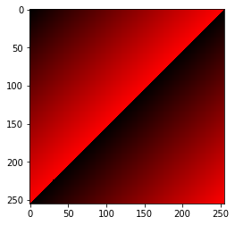


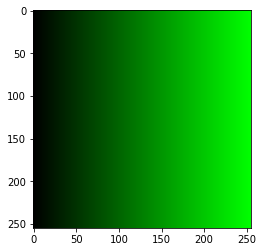


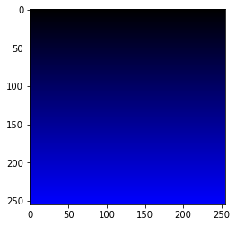


```python
split(cv2.imread("img/moto.png"))
```


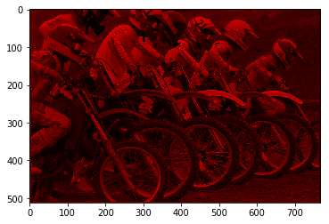


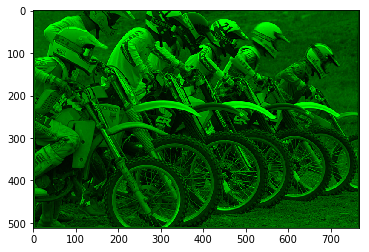


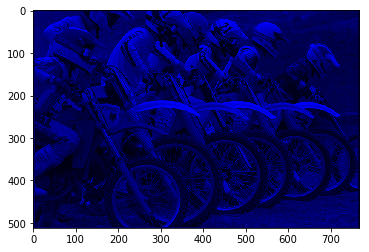


```python
split_ycbcr(cv2.imread("img/colored.bmp"))
```


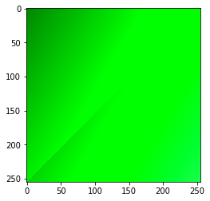


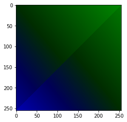


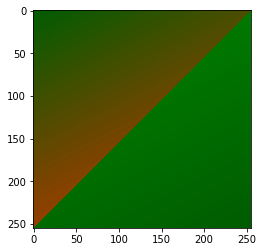


```python
split_ycbcr(cv2.imread("img/moto.png"))
```


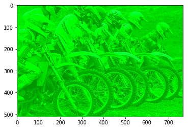


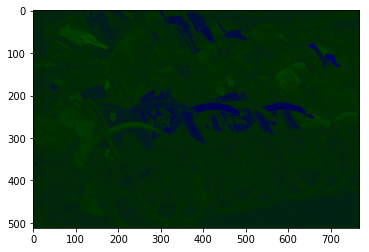


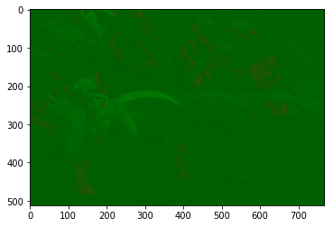

